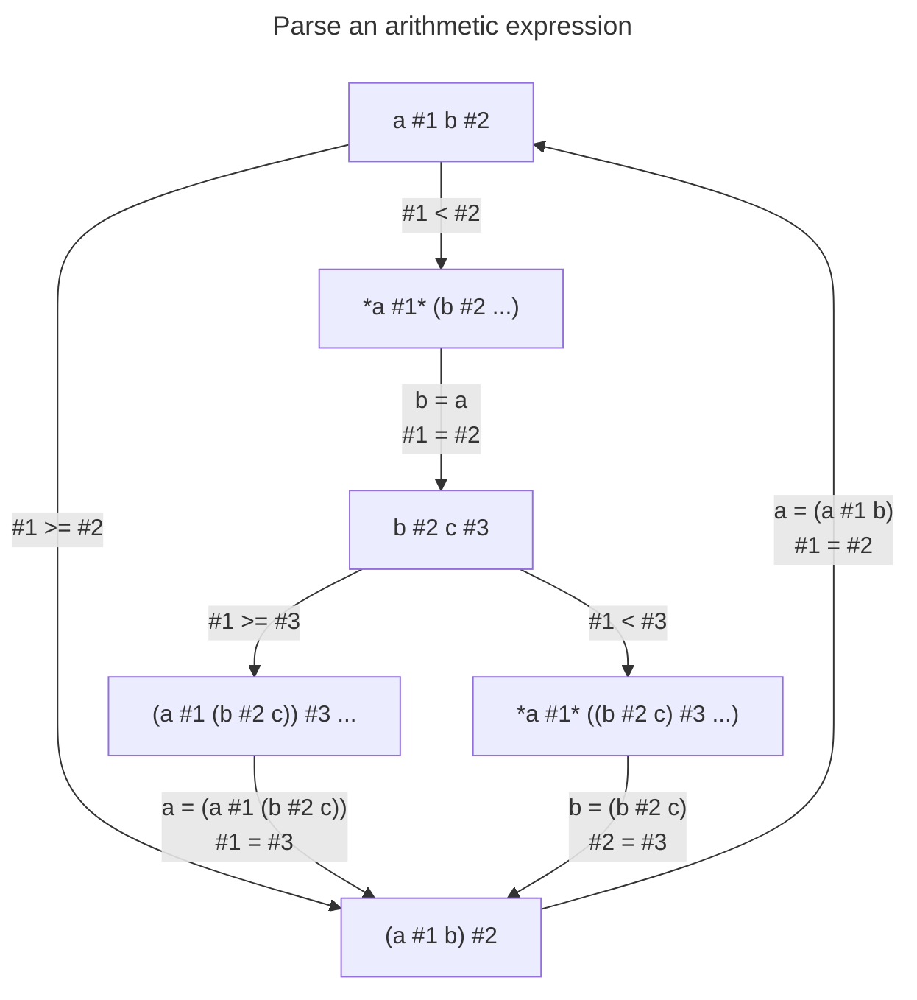

```mermaid
---
title: Parse an arithmetic expression
---

flowchart TD

a_b[a #1 b #2]

a_b -- #1 >= #2 --> lsd["(a #1 b) #2"]
lsd -- a = (a #1 b) \n #1 = #2 --> a_b

a_b -- #1 < #2 --> rsd["*a #1* (b #2 ...)"]
rsd -- b = a \n #1 = #2 --> b_c

b_c[b #2 c #3]

b_c -- #1 >= #3 --> rsd_rsd["(a #1 (b #2 c)) #3 ..."]

rsd_rsd -- a = (a #1 (b #2 c)) \n #1 = #3 --> lsd

b_c -- #1 < #3 --> rsd_lsd["*a #1* ((b #2 c) #3 ...)"]

rsd_lsd -- b = (b #2 c) \n #2 = #3 --> lsd

```