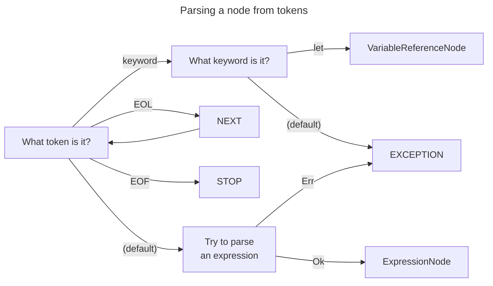
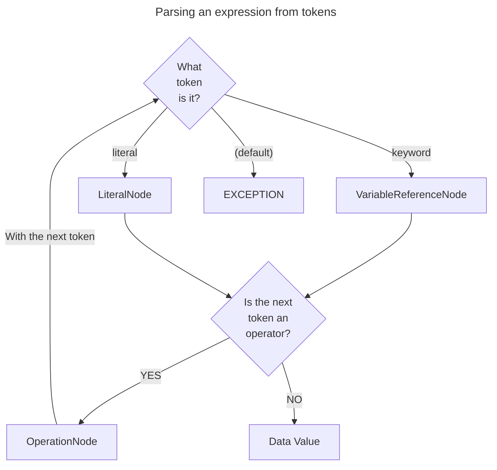

# Parsing Algorithm

## Nomenclature

- Node
  - Can be represented as a list of tokens: `node[token_pos]`
  - `prev`: The node before `current`
  - `current`: The current node to parse
  - `next`: The next node to parse, after `current`

## Main loop (parse_tree -> AST)

Iteration starts at `current[0]`, ends at `next[0]`.

1. Peek & match (`:t = current[0]`)
    1. keyword
        - 'let': SVariableDeclaration
    2. EOL: `NEXT_TOKEN + CONTINUE`
    3. EOF: `STOP`
2. Try to parse a expression, otherwise: `EXCEPTION`

## Parse Expression

