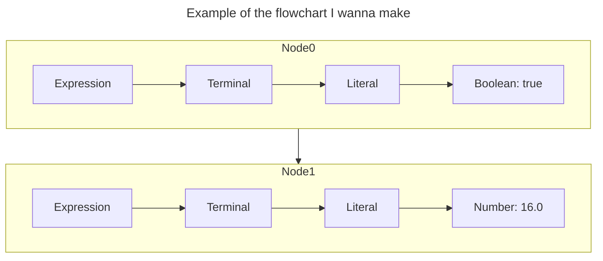

# Idea of generated flowcharts

```mermaid
---
title: Example of the flowchart I wanna make
---

flowchart TB

subgraph Node0
    direction LR
    n0_0[Expression]
    n0_0_0[Terminal]
    n0_0_0_0[Literal]
    n0_0_0_0_0[Boolean: true]

    n0_0 --> n0_0_0
    n0_0_0 --> n0_0_0_0
    n0_0_0_0 --> n0_0_0_0_0
end

subgraph Node1
    direction LR
    n1_0[Expression]
    n1_0_0[Terminal]
    n1_0_0_0[Literal]
    n1_0_0_0_0[Number: 16.0]

    n1_0 --> n1_0_0
    n1_0_0 --> n1_0_0_0
    n1_0_0_0 --> n1_0_0_0_0
end

Node0 --> Node1

```
